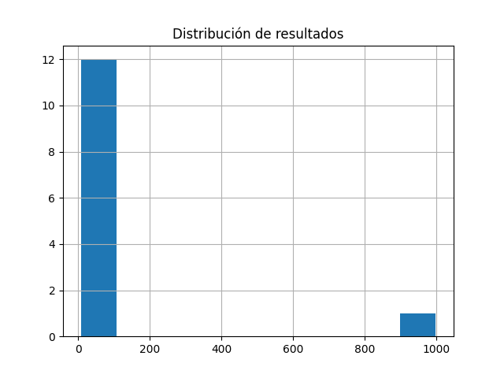
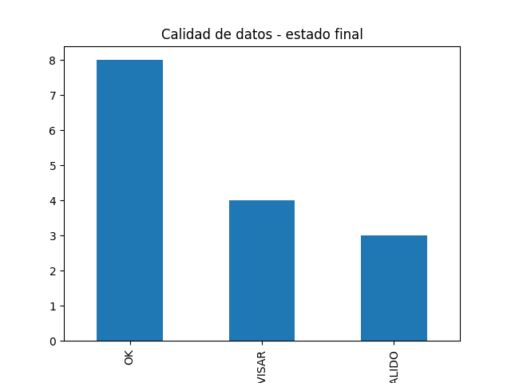
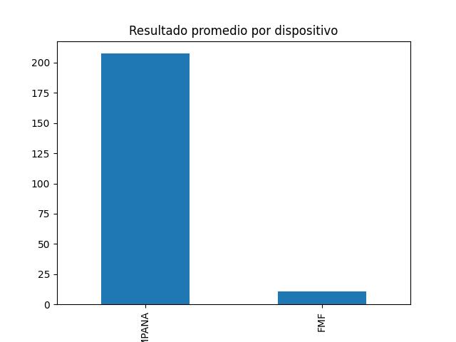

# Patient Device Usage Data Quality (Portfolio)

## Contexto
Proyecto de portfolio que simula el proceso de validación, limpieza y estandarización de datos clínicos
vinculados al uso de dispositivos médicos.

> Por confidencialidad, se utilizan datos ficticios con estructura realista.

## Qué hago en este proyecto
- Normalización de formatos (fechas, tipos, categorías)
- Reglas de calidad de datos (coherencia, rangos, nulos)
- Detección de duplicados potenciales
- Generación de variables derivadas: edad, IMC, etc
- Métricas de Data Quality para habilitar análisis e investigación

Se generaron visualizaciones para evaluar calidad del dato, distribución de resultados y comportamiento por tipo de dispositivo.
## 📈 Visualizaciones

### Distribución de resultados

### Calidad de datos

### Promedio por dispositivo

## Tecnologías
- Python (pandas)
- CSV (dataset ficticio)

## Estructura
- `dataset/` datos ficticios (`data.csv`) y salida limpia (`data_clean.csv`)
- `notebooks/` script de validación (`01_validation.py`)

## Salidas
- `dataset/data_clean.csv`: dataset con variables derivadas y flags de calidad
